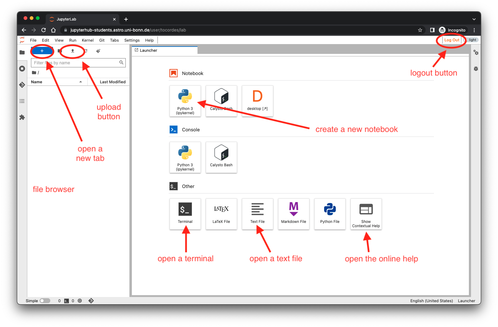
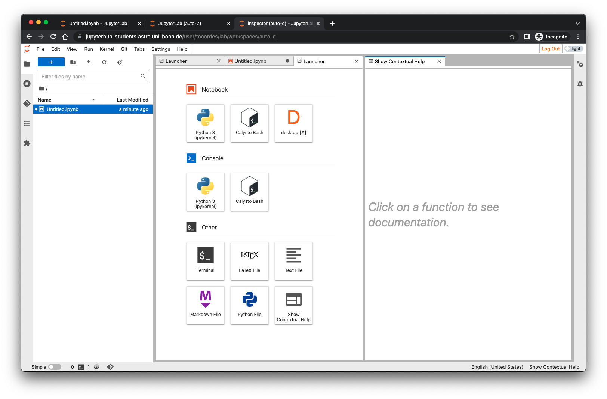

# Jupyterlab@AIfA - Manual


Dieses Dokument ist die Einführungsanleitung für das JupyterLab-System des Argelander-Institut für Astronomie.

Author: Oliver Cordes - 2022-10-11

----

**Inhaltsverzeichnis**

[TOC]


----

<div style="page-break-after: always"></div>

## 0. Vorbemerkungen

Bevor Sie mit der Anleitung beginnen, versichern Sie sich, dass Sie auf Ihrem Computer entweder den *Mozilla Firefox*- oder den *Google Chrome/Chromium*-Browser installiert haben. In der Vergangenheit hatten wir einige Probleme mit de m*Microsoft Edge*- und *Apple Safari*-Browser.

Es ist nicht notwendig spezielle Software auf Ihren Geräten, Laptops, Tablets oder Smart Phones zu installieren. Sie brauchen nur eine stabile Internet-Verbindung, einen Browser, eine Tastatur und eine Maus zum Bearbeiten der Dateien. Ein großer Monitor ist hilfreich bei Ihrer Arbeit mit der JupyterLab-Umgebung.

----

<div style="page-break-after: always"></div>

## 1. Einloggen in JupyterLab

Die JupyterLab-Umgebung läuft auf Servern im Argelander-Institut für Astronomie. Zum Start geben Sie folgende Adresse in Ihrem Browser ein: [https://jupyterhub-students.astro.uni-bonn.de]()


Sie sehen dann die Login-Seite:


Zum Einloggen drücken Sie den Button *Sign in with Shibboleth*. Sie werden dann zur Shibboleth-Login-Seite der Universität umgeleitet:


Zum Einloggen nutzen Sie bitte Ihre Uni-ID (meistens die Uni-Email-Adresse ohne *@uni-bonn.de*). Nachdem Sie das Passwort eingegeben haben, werden Sie zurück auf eine Seite des JupyterLab-Umgebung geleitet, auf der Sie Ihre Software-Umgebung (auch Software-Profile) auswählen können:


Auf dieser Seite können Sie jedes Profil auswählen, welches für Ihre Vorlesung/Workshop oder Software-Umgebung passt. Sie können Ihre persönlichen Daten in jedem Profil an der gleiche Stelle nutzen. Der Unterschied zwischen den Profilen ist nur die Softwareinstallation und eventuelle statische Daten.

Nachdem Sie ein Profil ausgewählt haben, sehen Sie eine weitere Seite (manchmal auch nur für eine kurze Zeit):


Wenn alles gut gegangen ist, sehen Sie diese Seite nur für ein paar Sekunden bis Sie das Starten der JupyterLab-Umgebung sehen werden. Wenn es ein Probem mit dem Starten der Umgebung gibt, sehen Sie die Meldungen auf dem Bildschirm. Schauen Sie bitte in das FAQ am Ende des Dokumentes für weitere Hilfen.

Nach dem erfolgreichen Start der Umgebung sehen Sie diesen Standard-Desktop-Bildschirm:



Der Desktop ist wir ein typsiches GUI (Graphical User Interface) aufgebaut, Sie haben ein Menu oben links in dem Fenster, ein Panel an der linken Seite, welcher einen Datei-Browser darstellt und eine Hauptarbeitsfläche rechts, die wie ein Browser mit Reitern organisiert ist. Sie haben am Anfang immer den ersten Tab den *Launcher* offen. Weitere Tabs können Sie öffnen, wenn Sie das *Plus-Zeichen +* unter dem Hauptmenu klicken. In der oben rechten Ecke finden Sie einen Button *Log Out* mit dem Sie die Sitzung beenden können.


### 1.1 Der Datei-Browser

Der Datei-Browser ist ähnlich aufgebaut wie ein typischer Datei-Browser, den Sie von anderen Betriebssystemen her kennen. Er zeigt das aktuelle Verzeichnis und alle anderen Unterverzeichnisse und Dateien in dem aktuellen Arbeits-Verzeichnis. Sie können in die Unterverzeichnisse wechseln, in dem Sie auf den Namen in der Liste klicken. Um in das übergeordnete Verzeichnis zurück zu wechseln, klicken Sie auf das entsprechende Verzeichnis in dem Label des aktuellen Verzeichnisses. Der Datei-Browser hat ein paar schnelle Funktionen, die sich über ein Context-Menu erreichen lassen. Dieses Menu können Sie öffnen, in dem Sie die rechte Maustaste innerhalb des Datei-Browsers drücken. Eine Funktion ist z.B. das Erzeugen eines neuen Unterverzeichnisses:

 

Alle anderen Funktionen innerhalb des Context-Menus sind selbsterklärend. Wenn Sie einen Dopple-Klick auf eine Datei ausführen wird ein entsprechendes Programm geöffnet, z.B. ein Doppelklick auf ein Notebook öffnet den Notebook-Editor.

<div style="page-break-after: always"></div>

### 1.2 Der *Launcher*

Der *Launcher* wird geöffnet, wenn ein neuer Reiter geöffnet wird, Er hat hauptsächliche Start-Buttons für die installieren Tasks und Programmen, z.B. der Python-Notebook-Editor, einen Text-Editor oder ein Linux-Terminal.

### 1.3 Ein neues Python-Notebook erzeugen

Dieser Button erzeugt ein neues Python-Notebook und startet den Notebook-Editor. Der Name des Notebooks ist normalerweise *Untitled.ipynb* und das Notebook wird in dem aktuellen Areitsverzeichnis abgelegt. Sie sollten das Notebook direkt nach dem Start des Editors umbenennen. Schauen Sie dazu den Abschnitt 2 dieses Dokuments an!

### 1.3 Das Linux-Terminal

Mit diesem Button öffnen Sie ein neues Linux-Terminal in einem Reiter:


In this terminal you can use all linux commands which are normally installed on a linux system. Please note, that only programs are working which don't use any graphical environment e.g. X11. There is no possibiliy to start any of these programs or to establish a display forwarding tunnel even if you have an X11 server started! 

In diesem Terminal können Sie alle Linux-Befehle ausführen, wie in einem normalen Linux-System. Bedenken Sie bitte, dass nur Programm ausgeführt werden können, die keine graphische Umgebung, z.B. X11, brauchen. Es ist technisch nicht möglich, diese Programme zu starten, auch wenn Sie lokal einen X11-Server gestartet haben!

### 1.4 Die Context-Hilfe

Dieser Button startet ein Hintergrund-Hilfe-System welches im Abschnitt 2.4 dieses Dokuments beschrieben wird.

### 1.5 Der Upload-Button

Wenn Sie diesen Button drücken öffnet sich ein Dialog-Fenster Ihres Web-Browsers. Sie können dort eine Datei auswählen, die dann dirket in das aktuelle Arbeitsverzeichnis des Datei-Browsers hochgeladen wird.

### 1.6 Der Text-Editor

Dieser Button öffnet eine neue Text-Datei, welche den Namen *Untitled.txt* bekommt und im aktuellen Arbeitsverzeichnis abgelegt wird. Diese Text-Datei kann benutzt werden, um z.B. *Python-Skripte* zu erstellen. Sie sollten den Namen des Dateis direkt nach der Erstellung umbenennen. Nutzen Sie dazu dazu das Context-Menu (rechter Maus-Klick) auf dem Namen im Reiter.

------

<div style="page-break-after: always"></div>

## 2. Python-Notebook-Editor

In diesem Abschnitt werden wir Ihnen anhand eines Beispieles zeigen, wie der Notebook-Editor funktioniert. Dazu werden wir ein Notebook erzeugen mit Programm-Code und Dokumentation.

### 2.1 Erzeugen eines Beispiel-Python-Notebooks

Um ein neues Python-Notebook zu erzeugen, nutzen Sie den Launcher-Reiter (wenn kein Reiter offen ist, drücken Sie den *plus*-Button unter dem Hauptmenu) und klicken auf den Button *Python 3* in dem Notebook-Abschnitt.


Das neue Notebook bekommt den Namen *Untitled.ipynb* und wird in dem aktuellen Arbeitsverzeichnis im Datei-Browser abgelegt. Der erste Schritt wird nun sein, das Notebook umzubenennen. Dazu führen Sie einen Maus-Klick mit der rechten Maustaste auf dem Namen im Reiter aus. Dieses öffnet ein neues Context-Menu:

 

Wählen Sie *Rename Notebook* aus und geben Sie einen neuen Namen für das Notebook an:


Bitte bedenken Sie, dass das neue Notebook immer in dem aktuellen Arbeitsverzeichnis erzeugt wird. Wenn Sie es in einem anderen Verzeichnis erzeugen möchten, wechseln Sie bitte **vorher** in das richtige Verzeichnis im Datei-Browser (siehe Abschnitt 1.1). Wenn Sie das Notebook schon erstellt haben, können Sie mit einem rechten Maus-Klick das Context-Menu öffnen und dann erst *Cut* auswählen und dann in das korrekte Verzeichnis wechseln und dann über das Context-Menu *Paste* die Datei an die richtige Stelle verschieben.


### 2.2 Öffnen eines existierenden Notebooks

Der einfachste Weg ist ein Doppel-Klick auf ein Notebook in einem Verzeichnis im Datei-Browser. Diese Aktion öffnet den Notebook-Editor mit dem ausgewählten Notebook.


### 2.3 Ein Notebook bearbeiten

Nachdem wir ein leeres Notebook erzeugt haben, können wir es mit ein wenig Inhalt füllen. Ein Notebook in eine Aneinanderreihung (übereinander) von sogenannten Zellen (cells). Jede zelle kann einen verschiedenen Typ besitzen. Die wichtigsten Typen sind *Code-Zellen* und *Markdown-Zellen*. In *Code-Zellen* können Sie Ihren Programm-Code schreiben, der durch einen Hintergrund-Interpreter, einem *Kernel*, ausgeführt wird. In unserem Beispiel gibt es 
nur den *Python*-Kernel. In anderen Software-Profilen gibt es z.B. *bash*-, *Julia*-, *C++*-Kernel. *Markdown-Zellen* werden typischerweise dazu genutzt statische Inhalte in ein Notebook zu schreiben, z.B. Code-Dokumentation, Aufgabenbeschreibungen, Bilder usw.


In diesem Beispiel schreiben wir Python-Code in die erste Zelle:


Die este Zelle hat nun das Python-Äquivalent des typischen *Hello world!*-Programm. Nachdem der Code in die Zelle geschrieben wurde, können Sie die Zelle ausführen, indem Sie die Tastenkombination *Shift-Enter* drücken. Das Ergebnis des Ausführens wird unter der Zelle ausgegeben.


Nach der Ausführung erzeugt der Notebook-Editor eine weitere leere Zelle mit dem Typ *Code*.
Wir wollen nun diese Zelle in eine *Markdown-Zelle* umwandeln. Dazu klicken Sie auf das Code-Menu des Editors:


Wählen Sie *Markdown* aus, um den Typ der Zelle zu ändern:


Das Layout der Zelle hat sich verändert und Sie können nun Inhalt einfügen. Markdown-Kommandos werden in Abschnitt 6 aufgeführt. Ein interessantes Feature ist die Möglichkeit neben Texten auch $\LaTeX$-Kommandos auszuführen, z.B. mathematische Formeln werden ähnliich dargestellt wie in $\LaTeX$-Dokumenten.

 

Wenn Sie nun diese Zelle mit *Shift-Enter* ausführen, sehen Sie nun Ihren Text der Zelle formatiert dargestellt:


$\LaTeX$-Kommandos werden perfekt interpretiert.

Um existierende Zellen des Notebooks zu bearbeiten, führen Sie einfach ein Doppel-Klick mit der Maus auf der Zelle aus. Dann sind Sie wieder in dem Editier-Modus der Zelle. Sie können auch jederzeit den Typ der Zelle verändern, wenn Sie z.B. mit einer Code-Zelle gestartet sind und eigentlich ein Dokumentation schreiben wollten.

In jedem Fall nachdem Sie den Inhalt des Notebooks verändert haben, sollten Sie das komplette Notebook mit dem typischen Save-Kommando *cmd-S* (MacOS), *Ctrl-S* (Linux, Windows?) sichern. Sie können auch das Hauptmenus nutzen, die alle nötwendigen Funktionen eines Standard-Editors bereitstellen, die Sie vielleicht kennen.


### 2.4 Das *Run cell*-Menu

In dem Editor-Menu ist ein spezielles Menu *Run*. Mit dieser Funtion können Sie eine oder mehrere Zellen Ihres Notebooks ausführen. Dieses ist sinnvoll, wenn Sie viele Code-Zellen verändern und ausführen wollen.


### 2.3 Das *Python kernel*-Menu

Es kann beim Programmieren oder Testen von Programm-Codes passieren, dass Probleme auftauchen, z.B. Endlosschleifen. In diesem Fal ist das *Kernel*-Menu wichtig. Hier finden Sie Funktionen, mit denen Sie die Arbeit des Kernels unterbrechen oder neu starten können.


### 2.4 Context-Hilfe für Python-Notebooks

Ein nettes Feature der JupyterLab-Umgebung ist die *Context-Hilfe*. Sie können diese Hilfe aktivieren, indem Sie auf den *Contextual Help*-Button im Launcher-Reiter drücken. Dann öffnet sich ein leerer Reiter.



Gehen Sie nun zurück zu einem Notebook-Editor. In der ersten Code-Zelle haben wir das Python-Kommando *print*. Klicken Sie nun die linke Maustaste und aktivieren Sie die Zelle und klicken Sie ein zweites Mal auf das *print*-Kommando. Sie können auch die Tastenkombination *cmd-I* (MacOS) oder *Ctrl-I* (Linux/Windows) nutzen, die Hilfe-Funktion zu starten. Die *Contextual Help*-Seite sollte nun den Hilfe-Eintrag für das *print*-Kommando zeigen. Wenn Sie nun ein anderen Befehl eingeben, verändert sich die Seite, sobald eine gültiger Befehl erkannt wird.


------

<div style="page-break-after: always"></div>

## 3. Daten-Transfer 

Die JupyterLab-Umgebung ist ein abgeschlossenes System, welches von aussen nur durch den Web-Browser zugänglich ist. Es gibt keinen Weg Daten *rein* oder *raus* in die Umgebung zu transferieren, wenn Sie nicht eingeloggt sind.

Wenn Sie eingeloggt sind, haben Sie zwei Möglichkeiten Daten *rein* und *raus* zu koperen:

1. Im Datei-Browser können Sie bei jeder Datei mit der rechte Maustaste das Context-Menu aufrufen, in dem eine *Download*-Funktion angeboten wird. Diese Funktion lädt die Datei auf Ihr lokales Gerät herunten. Um Dateien in die Umgebung hochzuladen, nutzen Sie den *Upload*-Button (siehe Abschnitt 1.5). Alle hochgeladenen Dateien werden in dem aktuellen Arbeitsverzeichnis abgelegt. Wenn Sie in dem Datei-Browser auf ein freies Feld das Context-Menu mit der rechten Maustaste aufrufen, finden Sie eine Funktion *Download current folder as an archive*. Wenn Sie diese aufrufen, bekommen Sie das aktuelle Verzeichnis als Archiv zum herunterladen angeboten. Der Name des Archivs richtet sich nach dem Namen des aktuelle Verzeichnis. In dem Archiv finden Sie das Verzeichnis auch als Archiv-Verzeichnis wieder! 
2. Die andere Möglichkeit Daten in und aus der Umgebung zu kopieren ist die Nutzung von Kommandozeilen Programmen im Terminal-Reiter. In dem Terminal haben Sie direkten Zugriff auf das Ubuntu Linux OS welches z.B. *scp*, *wget*, *git*, usw. zum Datenaustausch bereitstellt.

------

## 4. Das Beenden der Arbeitssitzung

Der beste weg, die Arbeitssitzung zu beenden, ist die logout-Funktion. Sie können dafür den *logout button* in der oberen rechten Ecke des Browser-Fensters nutzen. Solange Sie sonst das Browser-Fenster offen lassen und mit dem Internet verbunden sind, bleiben Sie in der eingeloggt. Ansonsten kann der JupyterHub-Server die Sitzung automatisch beenden, z.B. bei längerer Inaktivität.

Wenn Sie sich wieder in einer neuen Sitzung anmelden, versucht die Software-Umgebung alle Reiter wieder zu öffnen, die bei der letzten Sitzung genutzt werden. Technisch löscht der Server Ihre Sitzung 30 Minuten nach dem Ausloggen, damit die Ressourcen anderen Nutzern zur Verfügung gestellt werden kann! Sie sollten darauf achten, sich auszuloggen, wenn Sie nicht weiter arbeiten wollen.

------

<div style="page-break-after: always"></div>

## 5. Tastatur-Kurzbefehle

Zum Bearbeiten der Jupyter-Notebooks haben wir ein paar Tastatur-Kurzbefehle zusammengestellt, die sehr nützlich sind (nicht alle Kurzbefehle sind hier erwähnt):

Wenn Sie mit MacOS arbeiten, ersetzen Sie bitte `command` für `control` (`Steuerung`). Drücken Sie bitte nicht _+_ (dies meint nur, dass beide Tasten gleichzeitig gedrückt werden sollen).


### 5.1 Kurzbefehle im  _command mode_ (ausserhalb der Zellen) or im _edit mode_ (innerhalb der Zellen) 
- `Shift` + `Enter` führt die markierte Zelle oder Zellen aus - wenn keine Zelle unterhalb existiert, füge eine neue Code-Zelle drunter ein

- `Ctrl` + `B` Aktiviert oder deaktiviert die linke Seitenleiste
- `Ctrl` + `S` Sichern und einen Checkpoint anlegen
- `Ctrl` + `Shift` + `S` Sichern als
- `Ctrl` + `F` Suchen

### 5.2 Kurzbefehle im  _command mode_ (ausserhalb der Zellen ohne blinkendem Cursor)

- `Enter` Aktiviert _edit mode_ in der aktivierten Zelle

- Nach oben scrollen mit dem Pfeil nach oben
- Nach unten scrollen mit dem dem Pfeil nach unten

- `A` Füge eine neue Zelle über der aktiven Zelle ein
- `B` Füge eine neue Zelle unter de aktiven Zelle ein

- `M` Verändere die aktive Zelle in eine Markdown-Zelle
- `Y` Verändere die aktive Zelle in eine Code-Zelle

- `Shift` + `Up Arrow` Selektiere die aktuelle und die Zelle darüber
- `Shift` + `Down Arrow` Selektiere die aktuelle und die Zelle darunter 
- `Ctrl` + `A` Selektiere alle Zellen

- `X` Schneide die selektierte Zelle(n) aus
- `C` Kopiere die selektierten Zelle(n)
- `V` Füge die Zelle(n) ein, die vorher kopiert/ausgeschnitten wurden

- `Shift + M` Führe mehere selektierte Zellen in einer Zelle zusammen

- `DD` (`D` zweimal) Lösche die aktuelle Zelle
- `00` (Null zweimal) Starte den Kernel neu

- `Z` Nehme die letzte Kommando-Aktion zurück

### 5.3 Kurzbefehle im _edit mode_ (innerhalb der Zellen mit blinkendem Cursor)

- `Esc` Aktiviert _command mode_

- `Tab` Code completion (oder Einrücken, wenn der Cursor am Anfang der Zeile steht)
- `Shift` + `Tab` Tooltip-Hilfe
- `Ctrl` + `Shift` + `-` Teilt die aktive Zelle an der Cursor-Position

### 5.4 Nützliche Kommands für den Code-Editor (funktioniert vielleicht):

- `Ctrl` + `]` Einrücken
- `Ctrl` + `[` nach links Rücken

- `Ctrl` + `/` Selektierte Zeilen kommentieren/oder Kommentarzeichen entfernen

Dazu alle üblichen Kurzbefehle für das Selektieren, Ausschneiden, Kopieren, Einfügen, Zurücknehmen, usw. 


------

<div style="page-break-after: always"></div>

## 6. Die Markdown-Sprache

In den Jupyter-Notebooks können Sie *Markdown-Zellen* nutzen, welche sehr nützlich sind für Notizen und Dokumentationen. Prinzipiell können alle bekannten html-Elemente genutzt werden, jedoch gibt es für verschiedene Aufgaben einfache und kürzere Markdown-Befehle.


### 6.1 Text-Stile

```
*Der Text ist kursiv geschrieben!*
_Der Text ist auch kursiv geschrieben!_
**Der Text ist fett geschrieben!**
__Der Text is auch fett geschrieben!__
```
*Der Text ist kursiv geschrieben!*<br>
_Der Text ist auch kursiv geschrieben!_<br>
**Der Text ist fett geschrieben!**<br>
__Der Text is auch fett geschrieben!__


### 6.2 Überschriften

```
# Überschrift 1
## Überschrift 2
### Überschrift 3
#### Überschrift 4
```

Überschriften eerscheinen in verschiedenen Größen, `# Überschrift 1` ist die Größte und die anderen werden dann kontinuierlich kleiner. (Ein Beispiel ist weggelassen, weil es dann
das Inhaltsverzeichnis stört!)


### 6.3 Listen

Listen gibt es als Aufzählung und als Spiegelstrich-Liste:

```
* Vor den Listen muss immer eine Leerzeile stehen (oder ein anderes Block-Element)
* Spiegelstrich-Listen fangen mit einem `*` vor jedem Element an
- `-` geht auch
	* Eine Einrückung erzeugt eine verschachtelte Liste
		1. Aufzählungen werden so gemacht.
		2. Jedes Element muss wie `1.` (Zahl-Punkt-Leerzeichen) beginnen
		42. Es macht keinen Unterschied, welche Zahl genutzt wird, es wird immer hochgezählt
		1. Man kann also jede Zeile mit `1.` beginnen
```

* Vor den Listen muss immer eine Leerzeile stehen (oder ein anderes Block-Element)
* Spiegelstrich-Listen fangen mit einem `*` vor jedem Element an
- `-` geht auch
	* Eine Einrückung erzeugt eine verschachtelte Liste
		1. Aufzählungen werden so gemacht.
		2. Jedes Element muss wie `1.` (Zahl-Punkt-Leerzeichen) beginnen
		42. Es macht keinen Unterschied, welche Zahl genutzt wird, es wird immer hochgezählt
		1. Man kann also jede Zeile mit `1.` beginnen


### 6.4 Inline-Code im Text

`Inline-Code` wird mit *rückwärts geneigten Hochkommata* (backticks) umrandet:  
`` `Inline-Code` ``

Wenn der  ``Code selber `Hochkommata` `` enthältz, die dargestellt werden sollen, können doppelte Hochkommata verwendet werden:
```` ``Code mit `Hochkommata` `` ````  (daran denken, dass die Leerzeichen das wichtigste Set an Hochkommata abgrenzen)


### 6.5 Block-Code im Text

Block-Code wird im Text mit einem  ```` ``` ```` angefangen und beendet. Wird eine Programmiersprache beim Start mitgegeben, so bekommt man den Block-Code mit Syntax-Hervorhebung in Farbe:

```
 ```python
 print('This is a code block')
 if a > 1:
   x = 1234
 else:
   x = 42
 ```
```
So wird das dargestellt:

~~~python
print('This is a code block')
if a > 1:
  x = 1234
else:
  x = 42
~~~


### 6.6 Eine horizontale Linie
Wenn Sie drei Sterne `***` oder drei Striche `---` in einer Zeile schreiben, wird daraus eine horizontale Linie erstellt:

***


### 6.7 Bilder

Um Bilder einzufügen, nutzt man am Besten das HTML-Kommando:

```

```


Dieses Kommando bietet alle Freiheiten, z.B. die relativen Größen des Bildes zu definieren, wenn es notwendig ist. Das Beispiel skaliert das Bild gleichmässig auf eine Höhe von 100 Pixeln.


### 6.8 Links

Links können als einfacher Text:

<https://jupyterhub-students.astro.uni-bonn.de>

oder mit einem Markdown-Kommando erzeugt werden:

```
[JupyterHub at AIfA](https://jupyterhub-students.astro.uni-bonn.de)
```

[JupyterHub at AIfA](https://jupyterhub-students.astro.uni-bonn.de)


### 6.9 $\LaTeX$-Code

Ein nettes Feature von Markdown-Zellen ist, dass man $\LaTeX$-Code direkt in den Text einfügen kann. Dies wird vielfach zum Setzen von mathematischen Ausdrücken genutzt:

```
Dies ist ein Text mit der Formel $f(x)=x^2$.
```

Dies ist ein Text mit der Formel $f(x)=x^2$.


Für Formel-Blöcke nutzt man diese Anweisungen:

```
$$
f(x) = \sum_{i=1}^n i  \\
     = \frac{n(n+1)}{2}
$$
```

$$
f(x) = \sum_{i=1}^n i  \\
  = \frac{n(n+1)}{2}
$$

### 6.10 Tabellen

Tabellen sind auch möglich, jedoch muss man etwas mehr schreiben.

Dies ist ein einfache Tabelle:

```
Erste Überschrift | Zweite Überschrift
----------------- | ------------------
Zellen-Inhalt     | Zellen-Inhalt
Zellen-Inhalt     | Zellen-Inhalt
```


Erste Überschrift | Zweite Überschrift
----------------- | ------------------
Zellen-Inhalt     | Zellen-Inhalt
Zellen-Inhalt     | Zellen-Inhalt

Der Inhalt der Tabellen-Zellen können auch ausgerichtet werden:

```
| linksbündig   | zentriert.           | rechtsbündig  |
|:------------- |:--------------------:| -------------:|
| Spalte 3 ist  | ein wortreicher Text |         $1600 |
| Spalte 2 ist  | zentriert            |           $12 |
| Zebrastreifen | sind hübsch          |            $1 |
```

| linksbündig   | zentriert            | rechtsbündig  |
|:------------- |:--------------------:| -------------:|
| Spalte 3 ist  | ein wortreicher Text |         $1600 |
| Spalte 2 ist  | zentriert            |           $12 |
| Zebrastreifen | sind hübsch          |            $1 |


----

<div style="page-break-after: always"></div>

## 7. FAQ

Hier sind ein paar Problemstellungen erwähnt, die helfen können, wenn es zu Problemen mit der JupyterLab-Umgebung kommt:

- Wenn ich mich eingeloggt habe, sehe ich nur eine weisse Seite?
	
  Sie arbeiten vermutlich mit dem *Microsoft Edge*-Browser, nutzen Sie bitte entweder einen
  *Mozilla Firefox*- oder *Google Chrome/Chromium*-Browser.

- Wenn ich mich eingeloggt habe, zeigt die Webseite ein Flackern?

  Sie arbeiten vermutlich mit einem alten  *Apple Safari*-Browser, nutzen Sie bitte entweder einen *Mozilla Firefox*- oder *Google Chrome/Chromium*-Browser.

- Die JupyterLab-Umgebung startet nicht ordentlich, was kann ich machen?

  Es gibt verschiedene Möglichkeiten, welche das ordentliche Starten verhindern. Wir haben einige bekannte aufgelistet:

  - Das Arbeitsverzeichnis konnte nicht gefunden werden. In diesem Fall informieren Sie Ihren Tutor oder [Oliver Cordes](mailto:Oliver Cordes <ocordes@astro.uni-bonn.de>)!
  - Das System hat keine verfügbaren Ressourcen mehr, z.B. zuwenige freie CPUs; in diesem Fall müssen Sie waren, bis ein anderer Nutzer seine Arbeitssitzung beendet hat!
  - Es liegt ein Hardware-/Software-Problem vor, bitte informieren Sie Ihren Tutor oder [Oliver Cordes](mailto:Oliver Cordes <ocordes@astro.uni-bonn.de>) !

- Die Context-Hilfe ist nicht verfügbar, nachdem cmd-/Ctrl-I gedrückt wurde?

   Wahrscheinlich ist kein Context-Hilfe-Reiter offen. Starten Sie diese im *Launcher*-Reiter und klicken Sie auf auf den *Contextual Help*-Button.

----
**Notes**: Der Text enthält einige Passagen aus der offiziellen Hilfe-Seite vom 
[Macdown-Editor ](http://macdown.uranusjr.com/).


