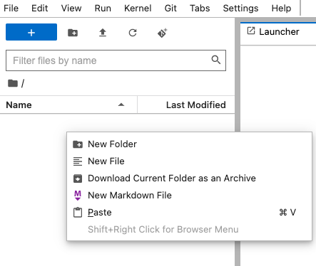
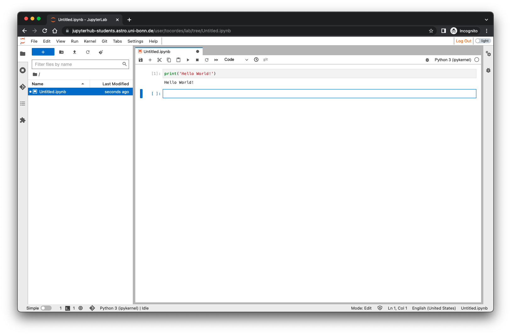
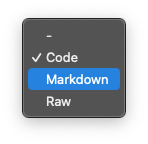
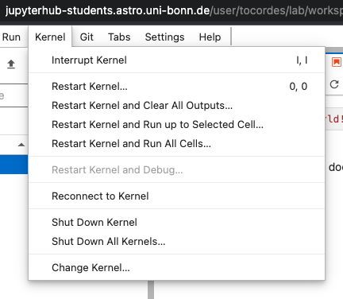

# Jupyterlab@AIfA - Manual

This document is the starting manual using the JupyterLab-System of the Argelander Institute for Astronomie. 

Author: Oliver Cordes - 2022-10-11

----

**Table of contents**

[TOC]


----

<div style="page-break-after: always"></div>

## 0. Prerequisites

Before you start with this manual please be sure that you're using either the *Mozilla Firefox* or *Google Chrome/Chromium* browser. We had a lot of problems with *Microsoft Edge* and *Apple Safari* browsers.

Also there is no need to install any special software on you devices, Laptop, Tables or Smart phones. You only need an internet connection, a working browser and a keyboard and mouse for editing files. A big screen for your work is in any case a good solution.

----

<div style="page-break-after: always"></div>

## 1. Login into JupyterLab

The JupyterLab environment is running on a server in the Argelander Institute for Astronomie. Type in the following address into any web browser:[https://jupyterhub-students.astro.uni-bonn.de]()

You will see the following login page:


For logging in press the button *Sign in with Shibboleth*. You will redirected to the university shibboleth login page:


For login please use you University-ID without the *@uni-bonn.de*. After you typed in your password, you will be redirected back to the jupyterhub page, in which you can choose your working environment (also called working profile):


On this page you can choose any existing profile which fits to the lecture or workshop or software enviroment. Your personal data will be available in the same structure in each of the profiles. The only difference may be the software environment and maybe some persistent data.

After choosing a profile you may see a page similar (only for a couple of seconds) to this:


If everything is going well, you will see this page only for a couple of seconds until you see the startup of the jupyterlab-enviromnent. If there is a problem during the startup please look at the FAQ at the end of this document.

After the successful start of the environment you will see this standard desktop screen:


The main desktop is organized like a typical gui (graphical user interface), you have a menu starting on the top left of the window, a left panel which is a file browser and a tabbed part which is the main working area. You will start always with one tab open which is the so called *Launcher*. You can add a new tab while clicking on the *plus sign +*  below the main menu.  Each new tab starts with the *Laucher*. In the top right corner you will find the logout button labled with *Log Out*. 

### 1.1 The file browser

The file browser is like the typical file browser you already know from different OSes. It shows the actual working directory and then all directories and files inside this working directory. You can switch to sub directories by clicking on some directory in the list. To move to upper directories please click on the specific directory in the working directory label. The file browser has some quick functions in a context menu which you can open by using the right hand mouse button, e.g. creating a new sub directory or renaming a file:

 

All other functions in the context menus are most self explaining. If you double-click on a file the corresponding program will be opened in a new tab, e.g. if you double-click on a notebook, the notebook editor will be opened.

<div style="page-break-after: always"></div>

### 1.2 The Launcher

This tab is visible every time a new tab is opened. It has the main start buttons for installed tasks and programs, e.g. an editor for Python notebooks, a text editor, a linux terminal etc. 

### 1.3 Create a new python notebook

This button opens a new python notebook, normally with the filename *Untitled.ipynb* in the current working directory. Please rename the notebook directly after creation. Follow Sect. 2  for an example.

### 1.3 The Terminal

With this button a new linux terminal will be opened in a new tab:


In this terminal you can use all linux commands which are normally installed on a linux system. Please note, that only programs are working which don't use any graphical environment e.g. X11. There is no possibiliy to start any of these programs or to establish a display forwarding tunnel even if you have an X11 server started! 

### 1.4 The Contextual Help

This button starts a backgroud help system which will be described in Sect.  2.4.

### 1.5 The Upload button

Using this button opens an uploading dialog of your web browser. You can choose a file wich will be uploaded into the current working directory of the file browser.

### 1.6 The text file editor

This button opens a new text file which is called *Untitled.txt* in the current working directory of the file browser. It can be used to create e.g. *python scripts*. Please rename the file directly after creation unsing the context menu (right mouse click) on the tab name.

------

<div style="page-break-after: always"></div>

## 2. Python notebook editor

In this section we will show how the notebook editor is working with an example. We will create a notebook with some code and documentation.

### 2.1 Example creation of a python notebook

To create a new python notebook, use the Laucher tab (if no tab is open, use the *plus* sign in the main menu) and click on the button labled with  *Python 3* in the Notebook section. The tab will now show an empty notebook. 


The new notebook will be named something similar to *Untitled.ipynb* and will be stored in the current directory of the file browser. The first step will be to rename the notebook. For this task do a right mouse click on the tab. This will open a context menu:

 

Choose *Rename Notebook* and enter a new name for the notebook:


Please keep in mind, that a new notebook will always be created in the current directoy of the file browser. If you want to have it in another directory please change the current directory in the file browser (see Sec. 1.1) before you create the notebook or if already created use the right mouse click for opening the context menu. You can use first *Cut* the file then *Paste* the file in the correct directory. 

### 2.2 Open an existing notebook

The simplest way is to double click on any notebook file in any directory in the file browser. This will open the notebook in a new tab!

### 2.3 Writing a notebook 

After we have created an empty notebook we can write some content into the notebook.  The complete notebook is arranged by so called cells which are stacked on top of each other. The cells can have different types. The important types are *code cells* and *markdown cells*. In *code cells* you can write your program code which can be executed by an interpreter running in the background which is called *kernel*. In this example the only kernel available is a *Python* kernel. In other configurations there are also *bash*, *Julia*, *C++* kernels available. *Markdown cells* are typically used to write static content e.g. code documentation, exercise descriptions, images etc. 

In this example we write some python code into the first cell:


The first cell has now the Python equivalent of the typical *Hello world!*-program. After a cell was edited you can execute the content by pressing *Shift-Enter*. The result of the execution is written below the previous edited cell:



 After any execution the notebook editor will create a new empty cell and the type of this cell will be *code*. Now we want to change the type of the cell into a *mark down documentation* cell. Therefor click on the code menu of editor:


Choose *Markdown* to change the type of the cell:



Now you the layout of the cell slightly changes and you can type some content. Markdown commands described in Sect. 6.  One interesting feature of such a mark down cell is that you can use $\LaTeX$ commands e.g. equations which are displayed similar to any $\LaTeX$ documents:

 

If you execute the cell with *Shift-Enter*, you will see the Text of the cell now rendered:


$\LaTeX$ commands are perfectly interpreted. 

To update existing cells in the notebook, you simply double click with your mouse on a cell and you are back in the edit mode. You can also change the type of the cell in the case that you started with a code cell and wanted to write some documentation. 

In any case after you've written content to the notebook you should save the complete notebook with the typical Save-Command *cmd-S* (MacOS), *Ctrl-S* (Linux, Windows?). You can also use the main menu which has all the necessary entries of a standard editor you probably know. 

### 2.4 The Run cell menu

In the editor menu there is a special menu called *Run*. With this menu you can run one or many cells of your notebook. This is sometimes necessary if you create many code cells.


### 2.3 The python kernel menu

Sometimes during tests of code cells you will face some problems, e.g. infinite loops. In this case the *Kernel* menu is important. Here you can find some commands to interrupt or restart the running kernel. 





### 2.4 Contextual help for python notebooks

A pretty nice feature of the jupyterlab environment is the *contextual help function*. To activate this feature you need to click once in a session on the *Contextual Help* button in the Laucher tab. This opens an empty new tab. 


Now go back to the notebook editor. In the first code cell we have the python command *print*. Use the left mouse click to activate the cell and click a second time on the *print* command. Then you can also use *cmd-I* (MacOS) or *Ctrl-I* (Linux/Windows) to activate the help function. The contextual help page should show the help page for the *print* command. If you enter a new command the help page will change if a valid command is detected.


------

<div style="page-break-after: always"></div>

## 3. Data transfer 

The jupyterlab environment is a closed system which is available from outside only though a web browser. There is absolutely no way to transfer data *in* and *out* of the environment if no web session is running. 

If a web session is running there are two possibilities to copy data *in* and *out*:

1. In the file browser you can use the context menu after clicking the right mouse button which provides you a *Download* entry. With this function you can download any files which is shown in the file browser. For uploading files you can use the *Upload* button (see Sect. 1.5). All uploaded files will be stored in the current working directory of the file browser. If you are using the right mouse button on an empty region of the file browser you will get an additional context menu with a *Download current folder as an archive* entry. This downloads the current folder in an archive to your local device. The name of the archive is the name of the current folder. In the archive you have the current folder as an archive folder!
2. The other possibility is to use any of the programs in a terminal tab. In the terminal there is a Ubuntu Linux OS running which provides some of the common programs for data exchange, *scp*, *wget*, *git*, etc. 

------

## 4. Ending a session

The best way is to logout in the case you stop working with the jupyterlab environment. You can use the *logout button*  on the top right of the browser window. As long as the browser window is open and you're connected to the internet you will be logged in. In any other case your session will automatically closed by the server.

If you login again the server will open all the tabs which were open during the logout process. So you can pick up your work at the same place. If you're logged out the server will destroy the session after 30 minutes to give the ressources to the next user! This means that you should logout properly when you don't want to use the system anymore!

------

<div style="page-break-after: always"></div>

## 5. Keyboard-Shortcuts


For editing Jupyter Notebooks here are some keyboard shortcuts which are quite helpful (not all shortcuts are mentioned):

If you are on a Mac, substitute `command` for `control`. Don't type the _+_ (it means press both keys at once).

### 5.1 Shortcuts when in either _command mode_ (outside the cells) or _edit mode_ (inside a cell) 
- `Shift` + `Enter` run selected cell or cells - if no cells below, insert a code cell below

- `Ctrl` + `B` toggle hide/show left sidebar

- `Ctrl` + `S` save and checkpoint
- `Ctrl` + `Shift` + `S` save as
- `Ctrl` + `F` find 

### 5.2 Shortcuts when in _command mode_ (outside the cells, no blinking cursor)

- `Enter` enter _edit mode_ in the active cell

- Scroll up with the up arrow 
- Scroll down with the down arrow

- `A` insert a new cell above the active cell
- `B` insert a new cell below the active cell

- `M` make the active cell a Markdown cell
- `Y` make the active cell a code cell

- `Shift` + `Up Arrow` select the current cell and the cell above
- `Shift` + `Down Arrow` select the current cell and the cell below
- `Ctrl` + `A` select all cells

- `X` cut the selected cell or cells
- `C` copy the selected cell or cells
- `V` paste the cell(s) which were copied or cut most recently

- `Shift + M` merge multiple selected cells into one cell

- `DD` (`D` twice) delete the active cell
- `00` (Zero twice) restart the kernel

- `Z` undo most recent command mode action

### 5.3 Shortcuts when in _edit mode_ (inside a cell with a blinking cursor)

- `Esc` enter _command mode_

- `Tab` code completion (or indent if at start of line)
- `Shift` + `Tab` tooltip help
- `Ctrl` + `Shift` + `-` split the active cell at the cursor

### 5.4 The usual commands for code editors (may work):

- `Ctrl` + `]` indent
- `Ctrl` + `[` dedent

- `Ctrl` + `/` toggle comment

Plus the usual shortcuts for select all, cut, copy, paste, undo, etc.


------

<div style="page-break-after: always"></div>

## 6. Markdown language

In Jupyter Notebooks you can use *Markdown cells* which are quite useful for notes and descriptions. Basically you can use any html-elements in the markdown cells, but for many tasks there are simple and short markdown commands.


### 6.1 Text styles

```
*Text is written in italic!*
_Text is also written in italic!_
**Text is written in bold!**
__Text is also written in bold!__
```
*Text is written in italic!*<br>
_Text is also written in italic!_<br>
**Text is written in bold!**<br>
__Text is also written in bold!__

### 6.2 Headlines

```
# Headline 1
## Headline 2
### Headline 3
#### Headline 4
```

The headlines appears in different sizes, `# Headline 1` is biggest and the others are continously smaller. (No example here, because this will break the table of contents!)


### 6.3 Lists

Lists are ordered or unordered:

```
* Lists must be preceded by a blank line (or block element)
* Unordered lists start each item with a `*`
- `-` works too
	* Indent a level to make a nested list
		1. Ordered lists are supported.
		2. Start each item (number-period-space) like `1. `
		42. It doesn't matter what number you use, I will render them sequentially
		1. So you might want to start each line with `1.` and let me sort it out
```

* Lists must be preceded by a blank line (or block element)
* Unordered lists start each item with a `*`
- `-` works too
	* Indent a level to make a nested list
		1. Ordered lists are supported.
		2. Start each item (number-period-space) like `1. `
		42. It doesn't matter what number you use, I will render them sequentially
		1. So you might want to start each line with `1.` and let me sort it out


### 6.4 Inline Code

`Inline code` is indicated by surrounding it with backticks:  
`` `Inline code` ``

If your ``code has `backticks` `` that need to be displayed, you can use double backticks:  
```` ``Code with `backticks` `` ````  (mind the spaces preceding the final set of backticks)


### 6.5 Block Code

You can write block code with a starting and ending ```` ``` ````. If you specify a name of
the coding language you can also use syntax highlighting:

```
 ```python
 print('This is a code block')
 if a > 1:
   x = 1234
 else:
   x = 42
 ```
```
This is the result:

~~~python
print('This is a code block')
if a > 1:
  x = 1234
else:
  x = 42
~~~


### 6.6 Horizontal Rules
If you type three asterisks `***` or three dashes `---` on a line, a horizontal rule will be displayed:

***


### 6.7 Images

For images the best way is to use the html commands:

```

```


This command has all freedom to specify the relative sizes of the image if necessary. The example scales the image to a height of 100 pixels.

### 6.8 Links

Links can be inserted as plain text:

<https://jupyterhub-students.astro.uni-bonn.de>

or with a markdown command:

```
[JupyterHub at AIfA](https://jupyterhub-students.astro.uni-bonn.de)
```

[JupyterHub at AIfA](https://jupyterhub-students.astro.uni-bonn.de)


### 6.9 $\LaTeX$ code

One nice feature is the possibility to include $\LaTeX$ code inside markdown cells. This is mostly used for math expressions:

```
This is a text with a formular $f(x)=x^2$.
```

This is a text with a formular $f(x)=x^2$.

For equation blocks, you can use:

```
$$
f(x) = \sum_{i=1}^n i  \\
     = \frac{n(n+1)}{2}
$$
```

$$
f(x) = \sum_{i=1}^n i  \\
  = \frac{n(n+1)}{2}
$$

### 6.10 Tables

Tables are possible, but needs some more characters.

This is a simple table:

```
First Header  | Second Header
------------- | -------------
Content Cell  | Content Cell
Content Cell  | Content Cell
```

First Header  | Second Header
------------- | -------------
Content Cell  | Content Cell
Content Cell  | Content Cell

You can align cell contents with syntax like this:

```
| Left Aligned  | Center Aligned  | Right Aligned |
|:------------- |:---------------:| -------------:|
| col 3 is      | some wordy text |         $1600 |
| col 2 is      | centered        |           $12 |
| zebra stripes | are neat        |            $1 |
```

| Left Aligned  | Center Aligned  | Right Aligned |
|:------------- |:---------------:| -------------:|
| col 3 is      | some wordy text |         $1600 |
| col 2 is      | centered        |           $12 |
| zebra stripes | are neat        |            $1 |

----

<div style="page-break-after: always"></div>

## 7. FAQ

Here are some questions which may help you in the case that you face some problems with the jupyterlab environment.

- When I logged into the system a see only a white empty page?

  You are probably using a *Microsoft Edge* brower, please use either a *Mozilla Firefox* or Google Chrome/Chromium browser.

- When I logged into the system the webpage is somehow flickering?

  You are probably using an *Apple Safari* browser, please use either a *Mozilla Firefox* or Google Chrome/Chromium browser.

- The jupyterlab environment didn't start normally, what can I do?

  There are different possibilities which prohibit the environment to start. In the past we have faced a few problems:

  - The home directory couldn't be attached to the running session, please inform your tutor or [Oliver Cordes](mailto:Oliver Cordes <ocordes@astro.uni-bonn.de>) !
  - The system is running out of resources, e.g. less CPUs; in this case please be patient and wait a couple of minutes until some of the users logged out!
  - The is a major hardware/software problem, please inform your tutor or Oliver Cordes!

- The contextual help is not working after pressing cmd-/Ctrl-I?

   Probably no conextual help tab is open. Please open a new *Launcher tab* and click on the *Contextual Help* button.

----
**Notes**: The texts contains some parts from the official help page of the 
[Macdown editor ](http://macdown.uranusjr.com/).


